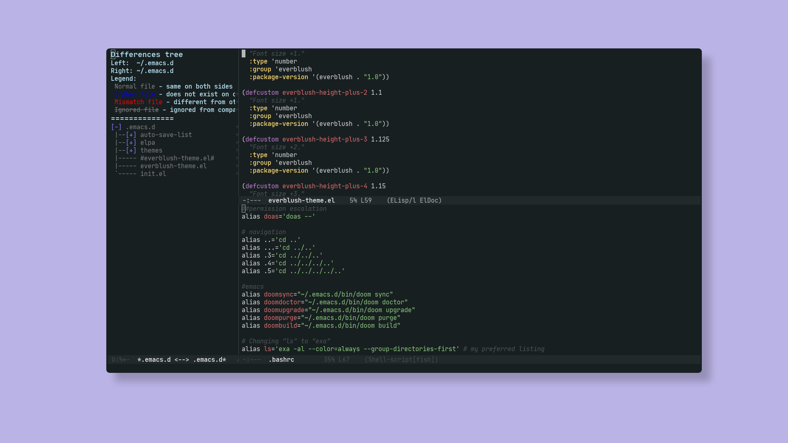

<div align="center">
 
</div> 

<h2 align="center"> Everblush Emacs </h2> 

## Preview



## Installation

run this command

```
wget https://raw.githubusercontent.com/Everblush/emacs/main/everblush-theme.el -O ~/.emacs.d/everblush-theme.el
```
then run ```M-x customize-themes``` and select Everblush.

## Credits

- Official fork from [Kborling](https://github.com/kborling)
- [Mangeshrex](https://github.com/mangeshrex)
- [SamuelNihBos](https://github.com/samuelnihbos)
